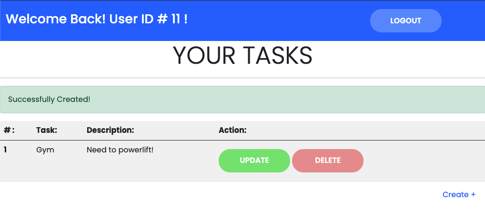

# ToDoList

## Overview
This application allows users to sign up with their own username / email / password for their account. This information will be stored in database, which in this case was being placed in [myphpadmin]. After a user signed into their account, they have access to writing their own todo list. Once the user has created their task, it will be placed in a table for them to see along with other tasks they might have saved before. This application also gives the user to either UPDATE or DELETE any tasks they choose and will be given an alert when this has successfully been accomplished.

## Application Features
1) Create and login to your account 
2) Create tasks
3) Update exsisting tasks
4) Remove exsisting tasks

## Technologies Used
HTML, CSS, Javascript, Node.js, PHP, MySQL, XAMPP, Bootstrap

## Future Goals For Project
- Design a better layout for creating a task & table where tasks are placed
- Organize folder structure 
- Revert database information into a single SQL file
- Give each task a due today of when it should be completed. It should turn yellow when it's due and red when it's overdue
- Adding more FA FA Icons in specific places to give the application more detail
